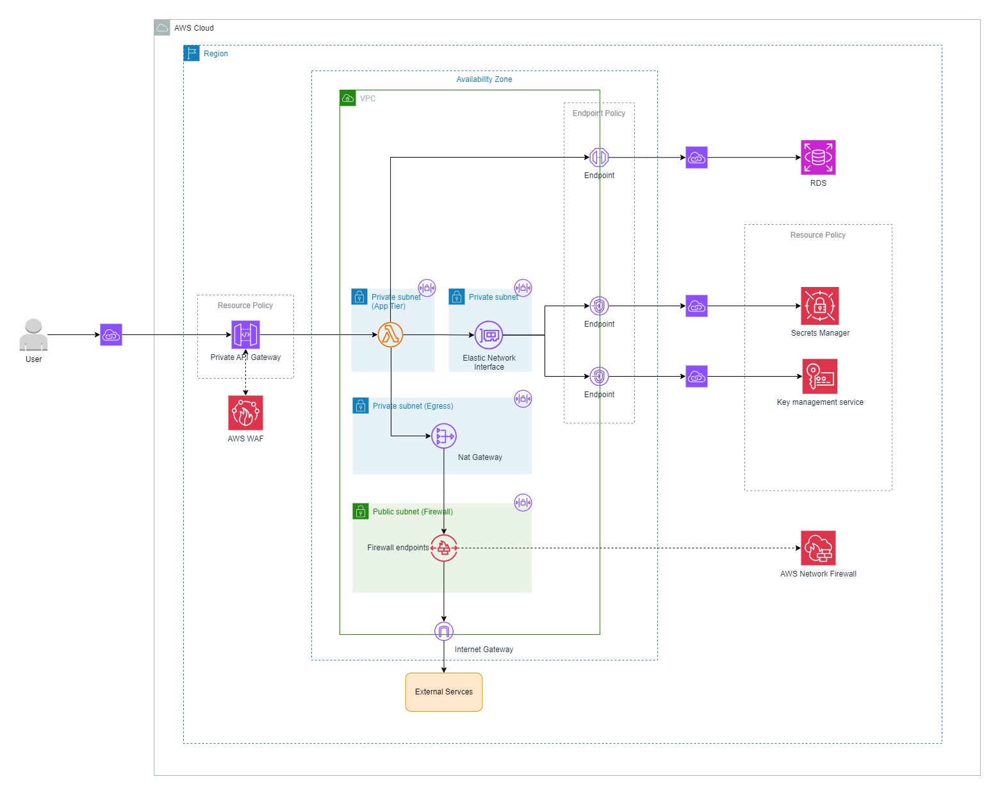
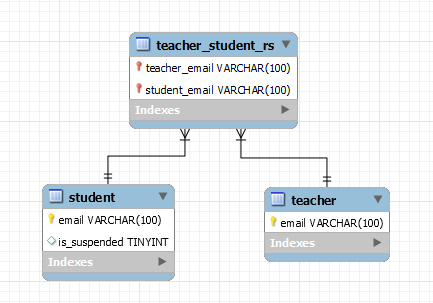

# gt-nodejs-dev-assessment

## Description
### Project brief
Teachers need a system where they can perform administrative functions for their students. Teachers and students are identified by their email addresses.

### Code structure
This Node.js application follows a structured and organized approach to maintain code modularity and clarity. The codebase is divided into several layers, each with its specific responsibilities similar to MVC design pattern. This allows easier testing, debugging and future enhancements.

#### App Layer
The App layer is the entry point of our application and it initializes the server
- Act as middleware to handles invalid path HTTP request

#### Routes Layer
Routes serve as the bridge between incoming HTTP requests and our application's functionality. 
- They define the URL paths and HTTP methods (GET, POST) for different endpoints of the API.

#### Controllers Layer
Receive requests from the routes, validates the data, and decide how to respond.
- Controllers interact with the service layer to perform CRUD (Create, Read, Update, Delete) operations and handle errors.

#### Services Layer
Services encapsulate the core functionality and business logic of our application. 
- Perform business logic validation and interact with the Database Access layer

#### Database Access Layer
The database access layer handles interactions with the database system.
- Execute database query and manager connections

#### Error handling
Error thrown uses the BaseError class that extends Error object which uses Object-Oriented-Programming(OOP) style

Benefits: Scalable to support more error type from extending base error with this we can minimize duplication of code in the future

## Installation and Setup
### MySQL database setup
Execute schema/script.sql in local MySQL database to create schema, tables and values

### Installing node modules
```
npm install
```
### Setup env variables
```
cp .env.example .env
```
1. Rename ".env.example" to ".env"
2. Replace <DB_USER> with your local MySQL database user (Example: root)
2. Replace <DB_USER_PW> with your local MySQL database root password


## How to run locally
```
npm run start
```

## How to test locally
```
npm run test
```

## API feature
### <b>API 1 - Register student</b>
#### Assumptions
- Student registered under specific teacher cannot be registered again
- Non-existing student can be registered
- Only existing teacher can register

#### Validations
- Content-Type can only application/json
- Student and teacher email must be provided in valid format
    - Format: [any characters or digits]@[any characters or digits].[any 2-4 characters long]
    - Example: studenthon@gmail.com
- API always receive students in list/array format even if there are one student
- Key(s) cannot be missing in body: teacher, students
- Value(s) cannot be empty

### <b>API 2 - Find common student</b>
#### Assumptions
- Teacher must exist in the database

#### Validations
- Only request parameter "teacher" key will be accepted
- Teacher email must be provided in valid format
    - Format: [any characters or digits]@[any characters or digits].[any 2-4 characters long]
    - Example: studenthon@gmail.com
- Key(s) cannot be missing in body: teacher
- Value(s) cannot be empty


### <b>API 3 - Suspend student</b>
#### Assumptions
- Student cannot be suspended again
- Only 1 student will be provided
- Can only suspend existing student

#### Validations
- Content-Type can only application/json
- Student email must be provided in valid format
    - Format: [any characters or digits]@[any characters or digits].[any 2-4 characters long]
    - Example: studenthon@gmail.com
- Key cannot be missing in body: student
- Value cannot be empty
- Check if student is already suspended

### <b>API 4 - Student for Notification</b>
#### Assumptions
- Student mentioned must be existing to be a recipient of notification
- Only existing teacher can send notification

#### Validations
- Content-Type can only application/json
- Student and teacher email must be provided in valid format
    - Format: [any characters or digits]@[any characters or digits].[any 2-4 characters long]
    - Example: studenthon@gmail.com
- Key(s) cannot be missing in body: teacher, notification
- Value(s) cannot be empty

## Architecture Diagram



## ER Diagram


